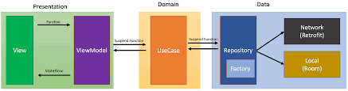
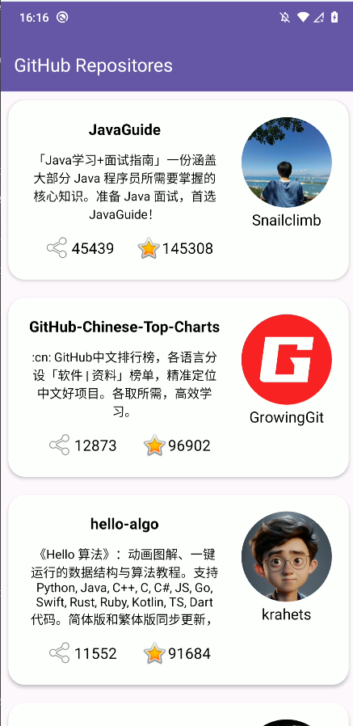
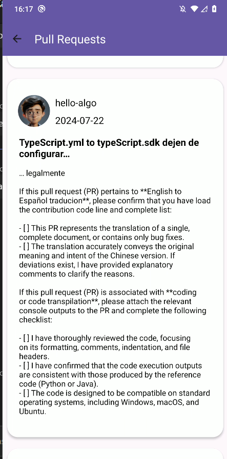

# Busca repositorios API GITHUB

Aplicativo Android que busca repositoricos melhores ranqueados na api do GitHub nas linguagens JAVA.
Foram utilizados as seguintes libs:

 - SDK: Android
 - Arquitetura: MVVM + Clean Architecture
 - Linguagem: Kotlin
 - IoC: Dagger2
 - Reatividade: ReactiveX
 - Testes Unitarios: Mockito
 - Mavegacao: Navigator
 - Network: Retroft e OKHTTP
 - Imagens: Glide
 - Parcelize: Gson

# Implementação do MVVM + Clean Architecture

Camadas separadas em:

- Presentation (Activity, Fragments, Adaptes, ViewModel ...)
- Domain (UseCase)
- Data (Reoisitory e DataSouce)

Comunicação entre camadas:

Fluxo:

- Listas de repositorios JAVA
- Listas de pull requests de um repositório selecionado
- Link para pull request no github.com

